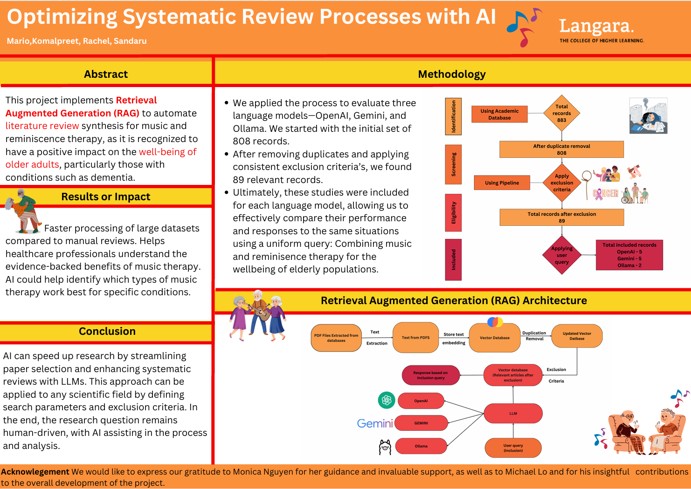

# Optimizing Systematic Review Processes with AI

## Project Overview

This capstone project leverages AI to optimize the process of conducting systematic literature reviews. Using Retrieval-Augmented Generation (RAG), we built an automated pipeline to identify and extract relevant studies from over 800 research papers focused on combining music and reminiscence therapy for improving the well-being of elderly individuals.

We collected data from four major academic databases, applied exclusion filters, and used vector-based storage (ChromaDB) for efficient retrieval. Three large language models (LLMs)—OpenAI, Gemini, and Ollama—were then evaluated on their ability to select the most relevant articles based on a predefined research question.

The OpenAI model achieved the highest accuracy (88%), followed closely by Gemini (87%) and Ollama (80%). This AI-driven approach significantly reduced manual workload, improved review consistency, and demonstrated strong potential for supporting evidence-based decision-making in healthcare research.

This project highlights how AI can streamline research processes and support human expertise in generating impactful insights for real-world applications.

## Project Poster

### Context of Project Files

* LLM_OpenAI.py, LLM_Ollama.py, LLM_Gemini.py contains the individual code for using OpenAI, Gemini and LLama3 as large language models to conduct systematic literature reviws.
* Research_paper_handling folder contains codes related to the identifying downloaded research papers, removing duplicates, moving them to one location to easily process the articles and identifying missing articles.
* Approach_2 folder contains the another code can be used for the process of conducting systematic literature review on research paper using Open AI.

### Acknowledgements

This project was developed as part of the Data Analytics Capstone at Langara College.
Special thanks to Monica Nguyen for her exceptional guidance and to Michael Lo for his insightful contributions.

Project Contributors:
* Sandaru Welikala
* Mario Palomino Viero
* Rachel Mendonsa
* Komalpreet Brar

